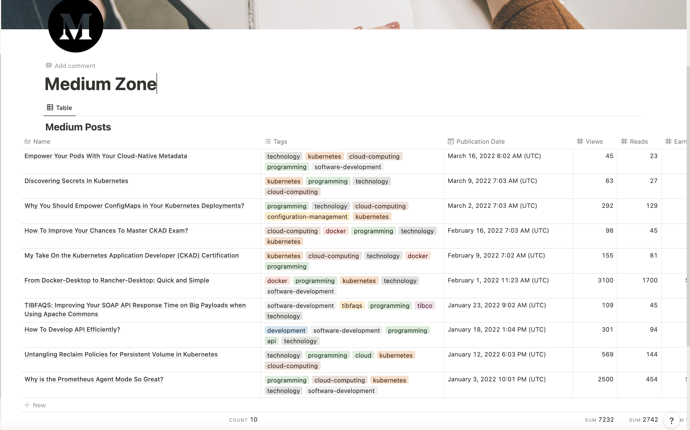

# Medium Notion Sync

## 📝 Table of Contents

- [How to use](#how_to_use)
- [Notion Requirements](#built_using)
- [Built Using](#built_using)
- [Authors](#authors)

## 🏁 <span id="how_to_use">How to use </span>

You need to define the .env file with the following data:

```
NOTION_KEY=secret_XXXXXXX
NOTION_DATABASE_ID=YYYYYYYYYYYY
MEDIUM_USER_ID=medium_user
SCHEDULER_CRON=* * * * * * 
```


Launching the tool

```
npm install
node index.js
```

## 📝  <span id="notion_req">Notion Requirements</span>

This is how looks like my Notion Database that I am using to import the posts:



The requirements are the following ones:

| Property Name  | Property Type   | 
|---|---|
| ID  |  Text |   
| URL  | URL  |   
| Name  | Title  | 
| Tags | Multi-Select |
| Publication Date | Date |  


## ⛏️ <span id="built_using">Built Using</span>

- [NodeJs](https://nodejs.org/en/) -  Environment

## ✍️ <span id="authors">Author</span>

- [@alexandrev](https://github.com/alexandrev) - Idea & Initial work